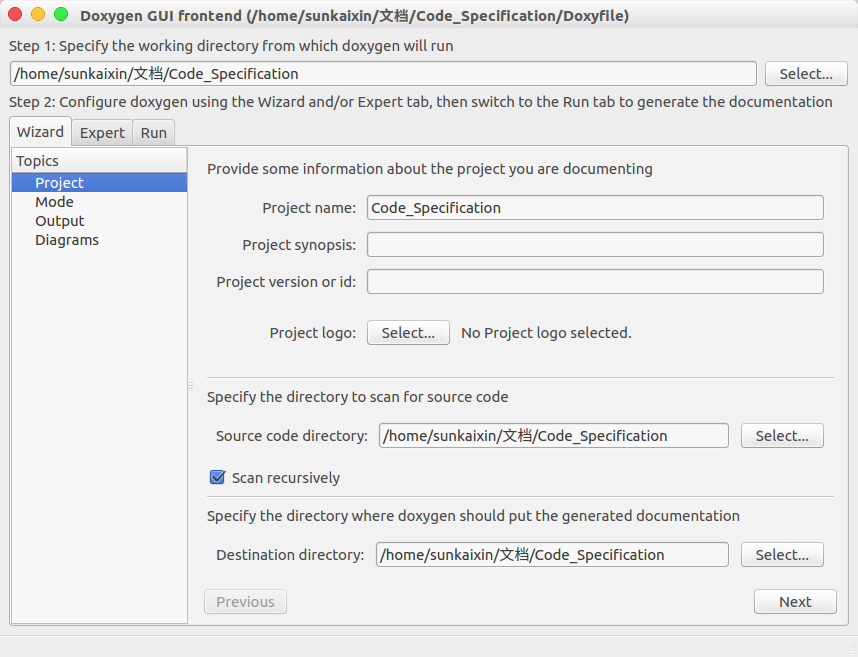
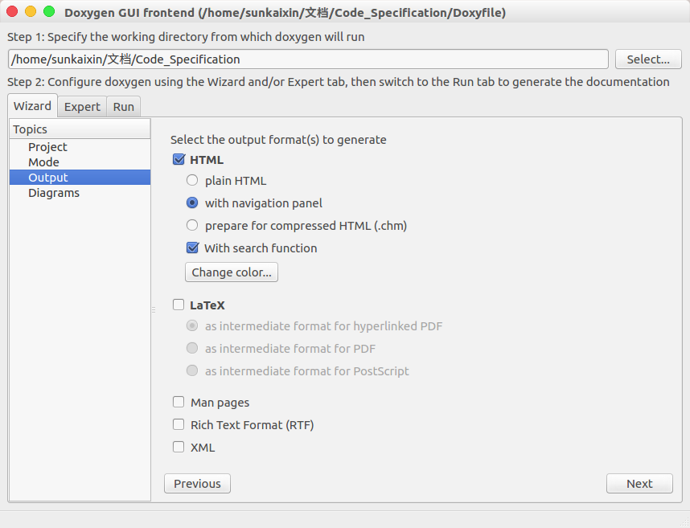
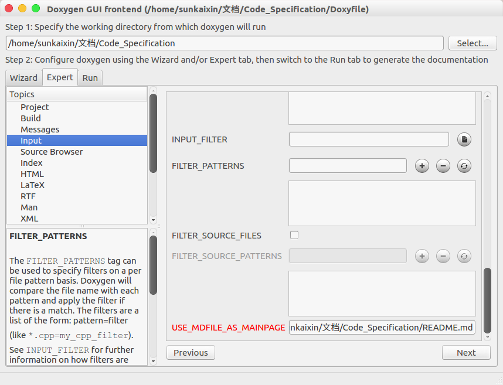
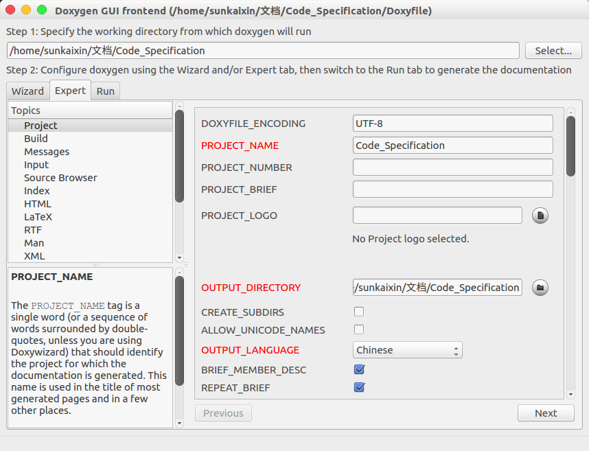
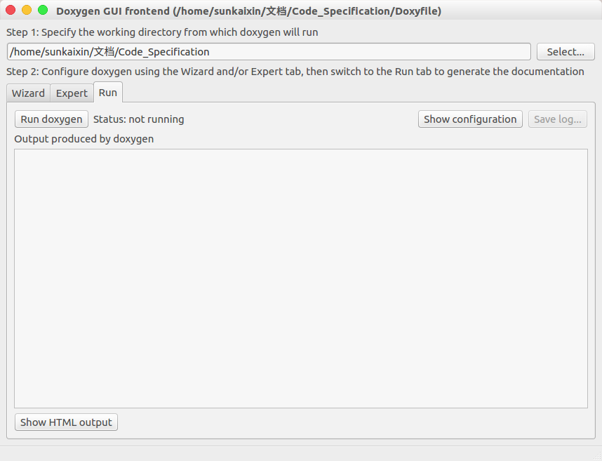

# 详细代码开发说明

## 目录
<!-- TOC -->

- [详细代码开发说明](#%E8%AF%A6%E7%BB%86%E4%BB%A3%E7%A0%81%E5%BC%80%E5%8F%91%E8%AF%B4%E6%98%8E)
    - [目录](#%E7%9B%AE%E5%BD%95)
    - [开发工具](#%E5%BC%80%E5%8F%91%E5%B7%A5%E5%85%B7)
    - [插件安装](#%E6%8F%92%E4%BB%B6%E5%AE%89%E8%A3%85)
        - [插件名称](#%E6%8F%92%E4%BB%B6%E5%90%8D%E7%A7%B0)
        - [插件安装](#%E6%8F%92%E4%BB%B6%E5%AE%89%E8%A3%85)
        - [其他软件及依赖安装](#%E5%85%B6%E4%BB%96%E8%BD%AF%E4%BB%B6%E5%8F%8A%E4%BE%9D%E8%B5%96%E5%AE%89%E8%A3%85)
        - [插件配置](#%E6%8F%92%E4%BB%B6%E9%85%8D%E7%BD%AE)
    - [代码开发规范](#%E4%BB%A3%E7%A0%81%E5%BC%80%E5%8F%91%E8%A7%84%E8%8C%83)
        - [项目及文件建立原则](#%E9%A1%B9%E7%9B%AE%E5%8F%8A%E6%96%87%E4%BB%B6%E5%BB%BA%E7%AB%8B%E5%8E%9F%E5%88%99)
        - [代码开发原则](#%E4%BB%A3%E7%A0%81%E5%BC%80%E5%8F%91%E5%8E%9F%E5%88%99)
        - [代码注释原则及doxygen使用说明](#%E4%BB%A3%E7%A0%81%E6%B3%A8%E9%87%8A%E5%8E%9F%E5%88%99%E5%8F%8Adoxygen%E4%BD%BF%E7%94%A8%E8%AF%B4%E6%98%8E)
            - [C++](#c)
            - [Python](#python)
            - [TODO使用规则](#todo%E4%BD%BF%E7%94%A8%E8%A7%84%E5%88%99)
            - [doxygen使用方法](#doxygen%E4%BD%BF%E7%94%A8%E6%96%B9%E6%B3%95)
    - [基于vscode的git使用方法](#%E5%9F%BA%E4%BA%8Evscode%E7%9A%84git%E4%BD%BF%E7%94%A8%E6%96%B9%E6%B3%95)

<!-- /TOC -->

## 开发工具

> 推荐但不限定于使用vscode作为代码开发工具，如不使用vscode，请遵循代码及注释规范。

工具名称：vscode

版本：暂不限定

下载地址：https://code.visualstudio.com/

安装方式：下载.deb格式安装包，直接双击或者执行```sudo dpkg -i xxx.deb```

安装包位置：```soft_deb/code_1.48.1-1597857616_amd64.deb```

## 插件安装

> 该插件可以帮助大家开发过程更加顺畅，并非强制要求。

### 插件名称

1、名称: C/C++

ID: ms-vscode.cpptools

说明: C/C++ IntelliSense, debugging, and code browsing.

版本: 1.0.1-insiders

发布者: Microsoft

VS Marketplace 链接: https://marketplace.visualstudio.com/items?itemName=ms-vscode.cpptools

2、名称: C++ Intellisense

ID: austin.code-gnu-global

说明: C/C++ Intellisense with the help of GNU Global tags

版本: 0.2.2

发布者: austin

VS Marketplace 链接: https://marketplace.visualstudio.com/items?itemName=austin.code-gnu-global

3、名称: Python

ID: ms-python.python

说明: Linting, Debugging (multi-threaded, remote), Intellisense, Jupyter Notebooks, code formatting, refactoring, unit tests, snippets, and more.

版本: 2020.8.109390

发布者: Microsoft

VS Marketplace 链接: https://marketplace.visualstudio.com/items?itemName=ms-python.python

4、名称: ROS

ID: ms-iot.vscode-ros

说明: Develop Robot Operating System (ROS) with Visual Studio Code.

版本: 0.6.4

发布者: Microsoft

VS Marketplace 链接: https://marketplace.visualstudio.com/items?itemName=ms-iot.vscode-ros

5、名称: Todo Tree

ID: gruntfuggly.todo-tree

说明: Show TODO, FIXME, etc. comment tags in a tree view

版本: 0.0.178

发布者: Gruntfuggly

VS Marketplace 链接: https://marketplace.visualstudio.com/items?itemName=Gruntfuggly.todo-tree

6、名称: Markdown All in One

ID: yzhang.markdown-all-in-one

说明: All you need to write Markdown (keyboard shortcuts, table of contents, auto preview and more)

版本: 3.3.0

发布者: Yu Zhang

VS Marketplace 链接: https://marketplace.visualstudio.com/items?itemName=yzhang.markdown-all-in-one

7、名称: Guides

ID: spywhere.guides

说明: An extension for more guide lines

版本: 0.9.3

发布者: spywhere

VS Marketplace 链接: https://marketplace.visualstudio.com/items?itemName=spywhere.guides

8、名称: GitLens — Git supercharged

ID: eamodio.gitlens

说明: Supercharge the Git capabilities built into Visual Studio Code — Visualize code authorship at a glance via Git blame annotations and code lens, seamlessly navigate and explore Git repositories, gain valuable insights via powerful comparison commands, and so much more

版本: 10.2.2

发布者: Eric Amodio

VS Marketplace 链接: https://marketplace.visualstudio.com/items?itemName=eamodio.gitlens

9、名称: Doxygen Documentation Generator

ID: cschlosser.doxdocgen

说明: Let me generate Doxygen documentation from your source code for you.

版本: 0.7.2

发布者: Christoph Schlosser

VS Marketplace 链接: https://marketplace.visualstudio.com/items?itemName=cschlosser.doxdocgen

10、名称: Bracket Pair Colorizer

ID: coenraads.bracket-pair-colorizer

说明: A customizable extension for colorizing matching brackets

版本: 1.0.61

发布者: CoenraadS

VS Marketplace 链接: https://marketplace.visualstudio.com/items?itemName=CoenraadS.bracket-pair-colorizer

11、名称: Auto Markdown TOC

ID: huntertran.auto-markdown-toc

说明: Markdown TOC (Table Of Contents) Plugin for Visual Studio Code.

版本: 3.0.12

发布者: Hunter Tran

VS Marketplace 链接: https://marketplace.visualstudio.com/items?itemName=huntertran.auto-markdown-toc

### 插件安装

1. ```Ctrl+Shift+X```打开扩展页面；
2. 在搜索栏搜索上述的插件名称或插件ID，找寻对应的插件；
3. 点击```install```进行安装；
4. 重新启动vscode。

### 其他软件及依赖安装

1. ```sudo apt-get install graphviz graphviz-doc```；
2. ```sudo apt-get install doxygen doxygen-gui```。

### 插件配置

1. ```Ctrl+Shift+P```打开控制端口；
2. 在控制端口中输入```settings json```，点击```Open Setting```；
3. 将下述配置粘贴至```settings.json```文件中，并按照注释进行修改：

```json
{
    "window.zoomLevel": 2,
    "editor.fontSize": 15,
    "workbench.colorTheme": "Horizon Bright Italic",
    "cmake.configureOnOpen": true,
    "explorer.confirmDelete": false,
    "terminal.integrated.shell.linux": "/bin/bash",
    "editor.renderIndentGuides": false,

    "git.ignoreMissingGitWarning": true,
    "gitlens.views.repositories.location": "gitlens",
    "gitlens.views.fileHistory.location": "gitlens",
    "gitlens.views.lineHistory.location": "gitlens",
    "gitlens.views.compare.location": "gitlens",
    "gitlens.views.search.location": "gitlens",
    "[markdown]": {
      "editor.defaultFormatter": "yzhang.markdown-all-in-one"
    },
    "files.autoSave": "afterDelay",
    "gitlens.gitCommands.closeOnFocusOut": true,
    "git.autofetch": true,
    "todo-tree.tree.showScanModeButton": false,
    "C_Cpp.updateChannel": "Insiders",
    "launch": {
      "configurations": [],
      "compounds": []
    },

    "doxdocgen.file.copyrightTag": [
      "@copyright Copyright (c) {year}  潍柴动力"
    ],
    "doxdocgen.file.customTag": [
        "@par 修改日志:",
        "<table>",
        "<tr><th>Date       <th>Version <th>Author  <th>Description",
        "<tr><td>{date} <td>1.0     <td>孙凯信     <td>内容",//这里改成自己的名字
        "</table>",
    ],
    "doxdocgen.file.fileOrder": [
        "file",
        "brief",
        "author",
        "version",
        "date",
        "empty",
        "copyright",
        "empty",
        "custom"
    ],
    "doxdocgen.file.fileTemplate": "@file {name}",
    "doxdocgen.file.versionTag": "@version 1.0",
    "doxdocgen.generic.authorEmail": "sunkaixin@weichai.com",//改成自己邮箱
    "doxdocgen.generic.authorName": "孙凯信",//改成自己名字
    "doxdocgen.generic.authorTag": "@author {author} ({email})",

    "doxdocgen.generic.order": [
        "brief",
        "empty",
        "tparam",
        "param",
        "return"
    ],
    "doxdocgen.generic.paramTemplate": "@param{indent:8}{param}{indent:25}My Param doc",
    "doxdocgen.generic.returnTemplate": "@return {type} ",
    "doxdocgen.generic.splitCasingSmartText": true,
    "editor.semanticTokenColorCustomizations": null,
}
```

## 代码开发规范

> 在本部分约束了代码开发过程中的行为规范，涉及到的部分功能使用不做详细概述

### 项目及文件建立原则

项目文件应由该项目的主程序员根据详细功能开发方案进行建立，写好相关README文件后，上传至gitlab，项目参与人员将项目git至本地，并按照README中的```项目分工（TODO）```进行开发。

### 代码开发原则

为了遵循**易读性**和**复用性**的原则，代码尽量遵循以下开发原则：

1. 按照文件目录由该目录的负责人进行功能封装，封装为函数或类；
2. 对于一个函数功能应建立单独的文件夹，方便后续的重载编写；
3. 函数、类、类函数等尽量都写成模板的形式；
4. 以尽量详细的要求来撰写注释，并符合doxygen注释要求；
5. 所编写的代码应经过单元测试后进行交付。

### 代码注释原则及doxygen使用说明

> Doxygen 是一个程序的文件产生工具，可将程序中的特定批注转换成为说明文件。提供了一套注释方式便于把代码中的注释生成说明文档。

#### C++

1、简单注释

 - 单行注释：/// 或者 //!
 - 多行注释：/** 或者 /*!

2、文件注释

 - 文件注释通常放在整个文件开头，例如：

```
/**下面@和后面关键字之间无空格
 * @ file perception.cpp
 * @ brief 本程序实现项目所需的感知功能，接收一个32线激光雷达信息、两个单线激光雷达信息，输出障碍物列表（lidarObject）
 * @ author 孙凯信 (sunkaixin@weichai.com)
 * @ version 1.0
 * @ date 2020-09-21
 * @ copyright Copyright (c) 2020  潍柴动力
 * 
 * @ par 修改日志:
 * <table>
 * <tr><th>Date       <th>Version <th>Author  <th>Description
 * <tr><td>2020-09-21 <td>1.0     <td>孙凯信     <td>内容
 * </table>
 */
``` 

> 当配置完成后，在文件开头输入```/**```后，点击```回车```，即可自动加载模板

3、类定义注释

 - 类定义的注释方式非常简单，使用@ brief后面填写类的概述，换行填写类的详细信息，例如：

```
/**下面@和后面关键字之间无空格
 * @ brief 测试类
 * 主要用来演示Doxygen类的注释方式
 */
 class Test
 {

 };
```

> 当配置完成后，在类定义前一行输入```/**```后，点击```回车```，即可自动加载模板，命名空间、结构体、联合体、枚举定义与类定义注释方式一致。

4、常量/变量的注释

> 常量/变量包括以下几种类型

 - 全局常量变量
 - 宏定义
 - 类/结构体/联合体的成员变量
 - 枚举类型的成员

注释分为两种方式，可根据具体情况自行选择：

 - 代码前注释

```
/// 注释
常量/变量
```

例如：

```
/// 缓存大小
#define BUFSIZ 1024*4
```

 - 代码后注释

```
常量/变量 ///< 注释
```

例如：

```
#define BUFSIZ 1024*4 ///< 缓存大小
```

5、函数注释

 - 函数注释通常放在整函数的前一行，例如：

```
/**下面@和后面关键字之间无空格
 * @ brief 此函数用于点云降采样，根据voxel_size对cloud_in点云进行体素滤波。
 * @ tparam PointT           点云模板
 * @ param  cloud_in         输入的点云
 * @ param  cloud_out        输出的点云
 * @ param  voxel_size_x     体素网格的长度
 * @ param  voxel_size_y     体素网格的宽度
 * @ param  voxel_size_z     体素网格的高度
 */
```

> 当配置完成后，在函数前一行输入```/**```后，点击```回车```，即可自动加载模板

根据函数需求，可进行详细函数注释：

```
/**下面@和后面关键字之间无空格
 * @ brief 函数简介
 * @ detail 详细说明
 * 
 * @ param 形参 参数说明
 * @ param 形参 参数说明
 * @ return 返回说明
 * @ retval 返回值说明
 * @ note 注解
 * @ attention 注意
 * @ warning 警告
 * @ exception 异常
 */
```

#### Python

>Python中的注释规则较为简单，未在vocode中配置快捷方式，利用多行注释的方式，在文件开头，函数、类等下一行进行注释即可

```
"""@ package docstring
Documentation for this module.
 
More details.
"""
 
def func():
    """Documentation for a function.
 
    More details.
    """
    pass
 
class PyClass:
    """Documentation for a class.
 
    More details.
    """
   
    def __init__(self):
        """The constructor."""
        self._memVar = 0;
   
    def PyMethod(self):
        """Documentation for a method."""
        pass
```

#### TODO使用规则

写代码过程中，突然发现一个Bug，但是又不想停下来手中的活，以免打断思路，怎么办？按代码编写会规范，都是建议在代码中加个TODO注释。比如这样：
```C
//TODO:这里有个bug，但是空间太小了，我的算法写不下。
```
或者
```C
//FIXME:哪个混蛋写的垃圾代码，会崩溃的。
```
当写完后即可在vscode资源管理器（```Ctrl+Shift+E```）中看到TODOS的列表清单，同时在程序中也会以高亮的形式体现出来。

#### doxygen使用方法

1、按```Ctrl+Shift+T```打开终端，输入```doxywizard```，按回车，打开doxygen可视化界面

2、设置工作路径、源代码路径（注意勾选scan recursively）、导出目录，如下图所示



3、设置输出选项，选择带导航页面的HTML，根据需求选择是否输出其他文件，如下图所示



4、在Expert页面可以进行详细配置，在input中将USE_MDFILE_ASMAINPAGE设置为主页面的README.md文件，如下图所示





5、在Run页面下点击Run doxygen，生成文档，打开html文件夹下的index.html文件即可，如下图所示



## 基于vscode的git使用方法

1. 在想要存放项目工程的目录下点击右键，选择“在终端中打开”；
2. 在终端界面输入```git clone http://10.0.72.50：9091/sunkaixin/Code_Specification.git```，其中网址为项目的git地址；
3. 然后在终端输入```code .```，打开当前目录下的vscode；
4. git相关操作按钮如下图所示，当在项目中进行更改后，更改内容会在git管理器中显示，当更改完成后，选择**分支版本**，然后点击**暂存更改**，然后点击**提交**，输入本次修改的简要说明，最后点击**一键同步**，实现git版本同步。

